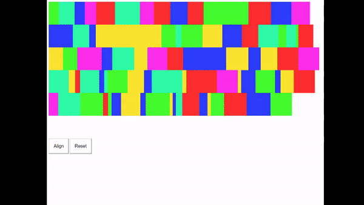

# Grid Align
<p align="center"></p>
**Grid Align** is a simple JavaScript library for aligning children of grid-like elements, so that there is no unused white space at the end of the rows.

NOTE: I know the algorithm is not perfect, but it is the fastest one I could come up with for working with a lot of items (100+)

## Options
### randomizeRows
Randomizes the order of the rows (excluding the last row).  With this option disabled, the larger elements will all be at the top of the grid.
```javascript
alignGrid(element, {
	randomizeRows: true
});
```

### animation
Duration (in milliseconds) animation should last during alignment.
```javascript
alignGrid(element, {
	animation: 1000
});
```
